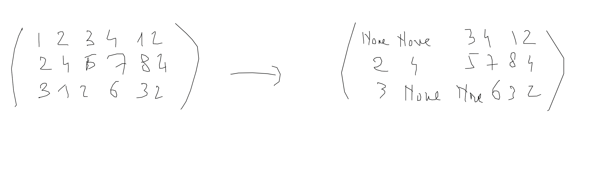
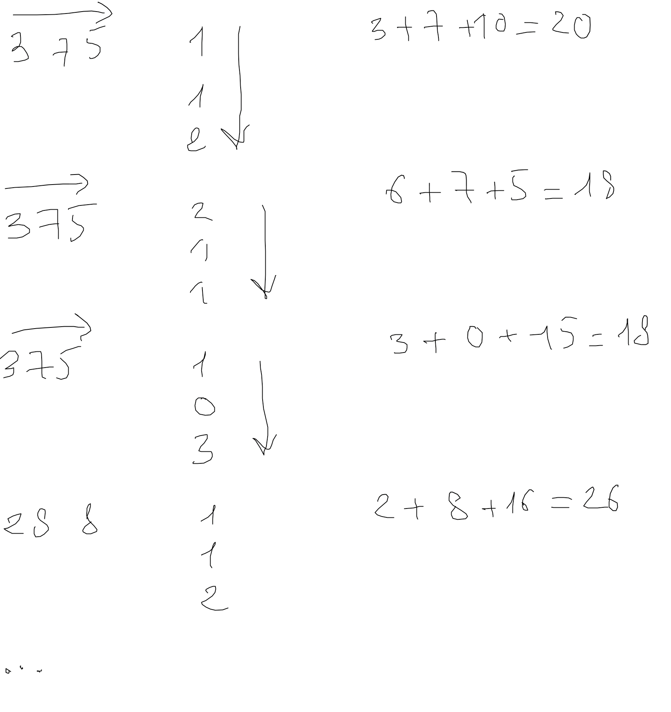

# Problèmes de synthese

## Exercice lettre en majuscule

Ecrire une fonction qui prend deux listes de même longueur et multiplie terme à terme les éléments de ces listes.

## Exercice le nombre le plus grand

Ecrire une fonction qui détermine le nombre le plus grand d'une liste de nombre d'entiers.

## Exercice

Trouvez tous les couples (a,b) de nombre tels que la somme de ces deux nombres fait 10.

## Recherche de séquence dans une matrice A

Soit une matrice A de taille $l \times c$ quelconque. Créez une fonction search_word permettant de rechercher par ligne un mot w. Vous retournerez tous les indices des lignes où se trouve ce mot dans la matrice A

## Recherche et remplacement

1. Créez une fonction qui cherche un mot dans une liste et qui remplace les lettres de ce mot par None dans la liste.

2. Utilisez la fonction du 1 pour remplacez dans une matrice le premier mot trouvé par une suite de None.

3. Généralisez le 2 et remplacez maintenant tous les mots de chaque ligne par une suite de None.

\newpage

## Produit de deux matrices

Nous avons déjà vu comment faire la somme de deux matrices. Faites maintenant le produit de deux matrices. Voici un exemple qui vous permettra de comprendre comment on obtient un tel produit.

Remarque : vous pouvez faire un produit de deux matrices si et seulement si le nombre de ligne(s) de la première matrice est égale au nombre de colonne(s) de la deuxième matrice.

Faire le produit d'une matrice par une autre c'est multiplier la ligne de la première matrice par la colonne de la deuxième et faire la somme. Voyez les exemples qui suivent et terminez le produit de ces deux matrices :

$\begin{pmatrix}
3 & 7 & 5 \\
2 & 8 & 8 \\
7 & 9 & 9
\end{pmatrix} \times 
\begin{pmatrix}
1 & 2 & 1 \\
1 & 1 & 0 \\
2 & 1 & 3
\end{pmatrix} =
\begin{pmatrix}
20 & 18 & 18 \\
26 & ... & ... \\
... & ... & ...
\end{pmatrix}$

Méthode :

\newpage

## Exercice diagonales et sous diagonales

Ecrire une fonction qui crée une matrice avec une diagonale de 1 et deux sous diagonales directement supérieur et inférieur de 1 de taille $n \times n$ (matrice carrée).
